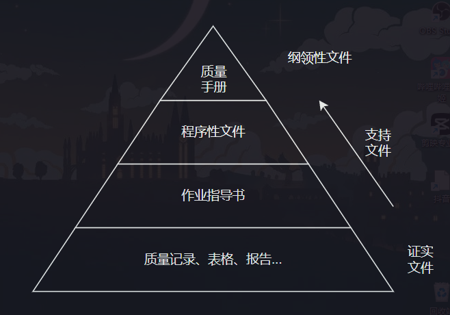

# 临床检验基础

## 作业: homework

### 1.一、简答

#### 1. 临床实验室专业分区有哪些?

1. 体液实验室
2. 临床血液学实验室
3. 临床化学实验室
4. 临床免疫学实验室
5. 临床微生物学实验室
6. 临床分子诊断学实验室
7. 血库 / 输血科

—— 临床检验基础(第二版).P28.t1.(1)

  —— 临床检验基础(第二版).P2.t2

#### 2. 简述质量管理体系文件的构成

  

—— 临床检验基础(第二版).P9.t2.(1)

#### 3. 简述红细胞计数、血红蛋白测定、白细胞计数、血小板计数的参考区间

1. 红细胞计数: (1)成年: 男性(4.3~5.8)x10^12/L, 女性(3.8~5.1)x10^12/L; (2)新生儿: (6.0~7.0)x10^12/L
2. 血红蛋白测定: 成年: 男性(130~175)g/L, 女性(115~150)g/L; (2)新生儿: (170~220)g/L
3. 白细胞计数: 成人: (3.5~9.5)x10^9/L; 儿童: (5~12)x10^9/L; 6个月~2岁:(11~12)x10^9/L; 新生儿: (15~20)x10^9/L
4. 血小板计数: (125~350)x10^9/L

—— 临床检验基础(第二版).P17.t2 
临床检验基础(第二版).P18 
临床检验基础(第二版).P24.t2 
临床检验基础(第二版).P30

#### 4. 异常红细胞分几类?简述每种类别

1. 红细胞大小异常
2. 红细胞形态异常
3. 红细胞染色异常
4. 红细胞结构异常

—— 临床检验基础(第二版).P20

#### 5. 简述网织红细胞的分型及特征

| 分型 | 特征 |
| --- | --- |
| I型(丝球型) | 嗜碱性物质呈致密块状 |
| II型(网型) | 嗜碱性物质呈酥松网状结构 |
| III型(破网型) | 嗜碱性物质呈散在的不规则枝点状结构 |
| IV型(点粒型) | 嗜碱性物质少, 呈分散的细颗粒、短丝状 |

—— 临床检验基础(第二版).P31

#### 6. 简述血小板的止血作用

1. 黏附功能: 血管内皮受损时, 血小板可直接黏附于暴露的内皮下成分, 如胶原纤维和弹性蛋白等, 也可由 vWF 及纤维连接蛋白等介导, 与暴露的教院纤维及弹性蛋白等结合, 使血小板黏附于受损伤管局部, 利于止血. 此外, 血小板也能黏附于周围的 Fg 和 vWF, 促进止血.
2. 聚集功能: 黏附的血小板可进一步被激活, 血小板形态发生变化, 伸出大量伪足, 在 $Ca^{2+}$ 参与下, 血小板发生聚集, 此为血小板的 "第一相聚集", 为可逆反应; 同时由于激活的血小板释放出 ADP 等内源性致聚剂可加速血小板的聚集, 使血小板发生不可逆的 "第二相聚集", 最终形成白色的血小板血栓, 完成初期止血或一期止血
3. 释放反应: 在致聚剂的作用下, 贮存在血小板 $\alpha$ 颗粒、致密颗粒和溶酶体中的某些活性物质如 TXA_2、ADP 等可通过开放管道系统释放到血小板外, 进一步增强血小板的活化和聚集, 并参与凝血过程

—— 临床检验基础(第二版).P52.t2

### 1.二、名称解释

#### 1. 核左移(shift to the left)

外周血中杆状核粒细胞增多或出现更幼稚的粒细胞时称为核左移。 核左移是机体的一种反应性改变, 常见于化脓性感染、急性溶血、急性失血等

—— 临床检验基础(第二版).P28.t1.(1)

#### 2. 核右移(shift to the right)

外周血中分叶核粒细胞增多, 并且5叶核以上的中性粒细胞超过 3% 时称为核右移。核右移常伴有白细胞总数减少

—— 临床检验基础(第二版).P28.t1.(2)

#### 3. 中性粒细胞的核象

中性粒细胞的核象是指粒细胞的分叶状况, 反映粒细胞的成熟程度

—— 临床检验基础(第二版).P28.t1

#### 4. 中毒颗粒(toxic granulation)

中性粒细胞胞质中出现粗大、大小不等、分布不均匀的紫黑色或紫褐色颗粒, 称为中毒颗粒. 常见于严重化脓性感染及大面积烧伤等, 可能与粒细胞颗粒生成过程受阻或变性有关

—— 临床检验基础(第二版).P28.t2.(2)

#### 5. 凝血

凝血是由凝血因子按一定顺序相继激活, 生成凝血酶, 最终使纤维蛋白原转变为纤维蛋白的过程

—— 临床检验基础(第二版).P52.t(二)

### 2.一、名词解释

#### 1. 天然抗体

凡是机体未出现明显的免疫学反应, 血清中却存在缺乏相应抗原的抗体, 这种抗体称为 "天然抗体"

—— 临床检验基础(第二版).P65.t1

#### 2. 免疫性抗体

机体经输血、妊娠等特定抗原免疫后产生的抗体称为 免疫性抗体

#### 3. 分泌型和非分泌型

#### 4. 血小板输注无效

### 2.二、简答

#### 1. ABO亚型的临床意义

#### 2. ABO血型系统中, 什么是正定型, 什么是反定型, 临床意义是什么?

#### 1. Rh血型系统中最重要的抗原有几种, 强弱顺序?

#### 2. 简述 交叉配血试验 的方法有哪些?

#### 3. 简述 临床常见输血不良反应 的种类

### 3.一、名词解释

#### 1. 晨尿

#### 2. 第二次晨尿

#### 3. 内眼血尿

#### 4. 镜下血尿

#### 5. 血红蛋白尿

#### 6. 糖尿

#### 7. 闪光细胞

#### 8. 管型

#### 9. 潜血

#### 10. 液化时间

#### 11. 线索细胞

### 3.二、简答

#### 1. 简述尿液管型形成的条件

#### 2. 精液检查的目的

#### 3. 简述精子活动力

#### 4. 简述 阴道分泌物 清洁度 的判断标准  

## 考试: [examination](examination.md)
